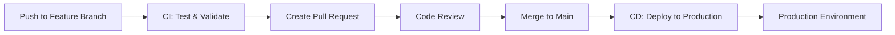

# Databricks Asset Bundles Demo Project

This documentation demonstrates **Databricks Asset Bundles** - a modern Infrastructure as Code (IaC) approach for managing Databricks resources like jobs, pipelines, notebooks, and configurations in a version-controlled, reproducible way.

**✨ Features:**
- Complete CI/CD pipeline with GitHub Actions
- Multi-environment deployment (dev/prod)
- Automated testing and validation
- Service principal authentication for production

## What are Databricks Asset Bundles?

Databricks Asset Bundles allow you to:
- **Version control** your Databricks resources (jobs, pipelines, notebooks)
- **Deploy consistently** across development, staging, and production environments
- **Collaborate effectively** with infrastructure as code principles
- **Automate deployments** with CI/CD pipelines

## Project Structure

```
test_databricks_asset_bundles/
├── .github/
│   └── workflows/                   # CI/CD pipelines
│       ├── ci.yml                  # Continuous Integration
│       └── cd.yml                  # Continuous Deployment
├── databricks.yml                   # Main bundle configuration
├── resources/                       # Resource definitions
│   ├── test_databricks_asset_bundles.job.yml      # Job configuration
│   └── test_databricks_asset_bundles.pipeline.yml # Pipeline configuration
├── src/                            # Source code
│   ├── notebook.ipynb             # Notebook for job task
│   ├── dlt_pipeline.ipynb         # Delta Live Tables pipeline
│   └── test_databricks_asset_bundles/
│       ├── __init__.py
│       └── main.py                # Python wheel entry point
├── tests/                          # Unit tests
│   └── main_test.py
├── requirements-dev.txt            # Development dependencies
├── setup.py                        # Python package configuration
└── README.md                       # This documentation
```

## Quick Start Guide

### 1. Prerequisites

Install the Databricks CLI using one of these methods:

**Using pip (Python):**
```bash
pip install databricks-cli
```

**Using PowerShell (Windows):**
```powershell
winget install Databricks.CLI
```

**Using apt (Ubuntu/Debian):**
```bash
curl -fsSL https://raw.githubusercontent.com/databricks/setup-cli/main/install.sh | sh
```

**Using Homebrew (macOS):**
```bash
brew tap databricks/tap
brew install databricks
```

### 2. Authentication

Authenticate to your Databricks workspace:
```bash
databricks configure
```

### 3. Initialize a New Bundle (Optional)

If you're creating a new project from scratch, you can initialize a bundle:
```bash
databricks bundle init
```

Choose the **default-python** template when prompted. This creates the same structure as this demo project.

### 4. Validate Configuration

Before deploying, validate your bundle configuration:
```bash
databricks bundle validate
```
This checks for syntax errors and configuration issues.

### 5. Deploy to Development

Deploy a development copy of this project:
```bash
databricks bundle deploy --target dev
```

**What happens during deployment:**
- Resources get prefixed with `[dev yourname]` for isolation
- Job schedules are automatically paused in development mode
- A Python wheel is built and uploaded from your source code
- Job and pipeline resources are created in your workspace

### 6. Deploy to Production

For production deployment:
```bash
databricks bundle deploy --target prod
```

**Production differences:**
- No resource name prefixes
- Schedules remain active
- Stricter permissions and configurations

### 7. Run Jobs and Pipelines

Execute specific resources by their KEY (resource identifier):

**Run the job:**
```bash
databricks bundle run test_databricks_asset_bundles_job
```

**Run the pipeline:**
```bash
databricks bundle run test_databricks_asset_bundles_pipeline
```

**Run with specific target (if not using default):**
```bash
databricks bundle run test_databricks_asset_bundles_job --target prod
```

**Run with no specific resource (shows available options):**
```bash
databricks bundle run
```

**Run with job parameters:**
```bash
databricks bundle run test_databricks_asset_bundles_job -- --param1 value1 --param2 value2
```

**Run pipeline with refresh options:**
```bash
databricks bundle run test_databricks_asset_bundles_pipeline --refresh-all
```
## Configuration Files Explained

### `databricks.yml` - Main Bundle Configuration

This is the central configuration file that defines your bundle:

```yaml
bundle:
  name: test_databricks_asset_bundles
  uuid: da3439c8-68ba-48bd-bcaa-af8f4ee4ad34

include:
  - resources/*.yml

targets:
  dev:                # Development environment
    mode: development # Enables dev-specific features (prefixed names, paused schedules)
    default: true
    workspace:
      host: ${DATABRICKS_DEV_HOST}  

  prod:               # Production environment
    mode: production
    workspace:
      host: ${DATABRICKS_HOST}
      root_path: /Workspace/Shared/prod/.bundle/${bundle.name}/${bundle.target}
    run_as:
      service_principal_name: ${DATABRICKS_SERVICE_PRINCIPAL_NAME}
```

### `resources/test_databricks_asset_bundles.job.yml` - Job Definition

Defines a multi-task job with dependencies:

```yaml
resources:
  jobs:
    test_databricks_asset_bundles_job:
      name: test_databricks_asset_bundles_job
      
      trigger:                    # Scheduled execution
        periodic:
          interval: 1
          unit: DAYS
      
      tasks:
        - task_key: notebook_task           # Task 1: Run notebook
          notebook_task:
            notebook_path: ../src/notebook.ipynb
            
        - task_key: refresh_pipeline        # Task 2: Refresh pipeline (depends on Task 1)
          depends_on:
            - task_key: notebook_task
          pipeline_task:
            pipeline_id: ${resources.pipelines.test_databricks_asset_bundles_pipeline.id}
            
        - task_key: main_task              # Task 3: Run Python wheel (depends on Task 2)
          depends_on:
            - task_key: refresh_pipeline
          python_wheel_task:
            package_name: test_databricks_asset_bundles
            entry_point: main
          libraries:
            - whl: ../dist/*.whl           # References built Python package
      
      job_clusters:                        # Cluster configuration
        - job_cluster_key: job_cluster
          new_cluster:
            spark_version: 15.4.x-scala2.12
            node_type_id: Standard_D3_v2
            autoscale:
              min_workers: 1
              max_workers: 4
```

### `resources/test_databricks_asset_bundles.pipeline.yml` - Pipeline Definition

Defines a Delta Live Tables (DLT) pipeline:

```yaml
resources:
  pipelines:
    test_databricks_asset_bundles_pipeline:
      name: test_databricks_asset_bundles_pipeline
      catalog: main                                    # Target catalog
      schema: test_databricks_asset_bundles_${bundle.target}  # Dynamic schema based on target
      libraries:
        - notebook:
            path: ../src/dlt_pipeline.ipynb           # DLT notebook source
      configuration:
        bundle.sourcePath: ${workspace.file_path}/src # Source code location
```

## CI/CD Pipeline

This project includes a complete CI/CD pipeline using GitHub Actions that automatically tests, validates, and deploys your Databricks Asset Bundle.

### Pipeline Overview



### Continuous Integration (CI)

**Triggers:** Pull requests and pushes to feature branches

**What it does:**
- ✅ Sets up Python environment
- ✅ Installs dependencies  
- ✅ Runs unit tests with pytest
- ✅ Performs code linting (flake8, black)
- ✅ Validates bundle configuration
- ✅ Uses development environment secrets

### Continuous Deployment (CD)

**Triggers:** Pushes to main branch (after PR merge)

**What it does:**
- 🚀 Validates production configuration
- 🚀 Deploys to production environment
- 🚀 Uses service principal authentication
- 🚀 Requires environment approval (security gate)

### GitHub Environment Setup

The pipeline uses GitHub Environments for secure secret management:

#### Development Environment
```
DATABRICKS_DEV_HOST = https://your-workspace.azuredatabricks.net
DATABRICKS_DEV_TOKEN = <your-development-token>
```

#### Production Environment  
```
DATABRICKS_PROD_HOST = https://your-workspace.azuredatabricks.net
DATABRICKS_PROD_TOKEN = <your-production-token>
DATABRICKS_SERVICE_PRINCIPAL_NAME = <your-service-principal>
```

### Workflow Commands

```bash
# Create feature branch
git checkout -b feature/new-pipeline

# Make changes and commit
git add .
git commit -m "feat: add new data pipeline"

# Push and create PR
git push -u origin feature/new-pipeline

# After PR approval and merge to main
# → Automatic production deployment
```

## Common Commands Reference

| Command | Purpose |
|---------|---------|
| `databricks bundle init` | Initialize a new bundle project |
| `databricks bundle validate` | Validate bundle configuration |
| `databricks bundle deploy --target dev` | Deploy to development |
| `databricks bundle deploy --target prod` | Deploy to production |
| `databricks bundle run <job_name>` | Run specific job (uses default target) |
| `databricks bundle run <pipeline_name>` | Run specific pipeline (uses default target) |
| `databricks bundle run <resource> --target <env>` | Run resource in specific environment |
| `databricks bundle destroy --target dev` | Delete all deployed resources |

## Development Workflow

### Local Development
1. **Make changes** to your code, notebooks, or configurations
2. **Validate** the bundle: `databricks bundle validate`
3. **Deploy** to dev: `databricks bundle deploy --target dev`
4. **Test** your resources: `databricks bundle run <resource>`

### CI/CD Workflow
1. **Create feature branch**: `git checkout -b feature/my-feature`
2. **Make changes** and commit: `git commit -m "feat: description"`
3. **Push branch**: `git push -u origin feature/my-feature`
4. **Create Pull Request** → Triggers CI pipeline
5. **Code review and approval**
6. **Merge to main** → Triggers CD pipeline → Production deployment

### Testing Strategy
- **Unit tests**: Python code testing with pytest
- **Bundle validation**: Configuration syntax and logic checks
- **Integration tests**: End-to-end pipeline validation (optional)
- **Production verification**: Post-deployment health checks

## Key Benefits Demonstrated

- **Environment Isolation**: Separate dev/prod configurations with different authentication methods
- **Dependency Management**: Jobs can depend on pipeline completion
- **Infrastructure as Code**: All resources defined in version-controlled YAML
- **Automated Building**: Python packages built and deployed automatically
- **Resource References**: Pipeline IDs dynamically referenced in jobs
- **CI/CD Integration**: Automated testing, validation, and deployment
- **Security**: Service principal authentication for production
- **Code Quality**: Automated linting and testing
- **Approval Gates**: Production deployments require manual approval

## Troubleshooting

**Validation Errors:**
```bash
databricks bundle validate
```

**Check Deployed Resources:**
```bash
databricks bundle summary --target dev
```

**View Logs:**
Check the Databricks workspace under **Workflows** for job execution details.

**CI/CD Pipeline Issues:**
- Check GitHub Actions logs in the repository's Actions tab
- Verify environment secrets are correctly configured
- Ensure service principal has proper permissions for production

**Common Issues:**
- **Catalog not found**: Create the required catalog in your workspace
- **Permission denied**: Verify token/service principal permissions
- **Bundle validation fails**: Check YAML syntax and resource references

## Next Steps

- **✅ CI/CD Pipeline**: Already implemented with GitHub Actions
- **Add more complex workflows** with multiple dependencies
- **Integrate with ML workflows** using MLflow
- **Explore advanced bundle features** like shared clusters and permissions
- **Add integration tests** for end-to-end validation
- **Implement blue-green deployments** for zero-downtime releases
- **Add monitoring and alerting** for production pipelines

## Additional Resources

- **Official Documentation**: [Databricks Asset Bundles](https://docs.databricks.com/dev-tools/bundles/index.html)
- **VS Code Extension**: [Databricks Extension](https://docs.databricks.com/dev-tools/vscode-ext.html) for local development
- **Databricks Connect**: [Setup Guide](https://docs.databricks.com/en/dev-tools/databricks-connect/python/index.html) for local testing
- **Deployment Modes**: [Understanding Dev vs Prod](https://docs.databricks.com/dev-tools/bundles/deployment-modes.html)
- **GitHub Actions**: [Databricks CI/CD](https://docs.databricks.com/dev-tools/ci-cd/ci-cd-github.html) integration guide
- **Service Principals**: [Authentication Setup](https://docs.databricks.com/dev-tools/service-principals.html) for production

---

*This project demonstrates enterprise-grade Infrastructure as Code with Databricks, featuring automated CI/CD pipelines, multi-environment deployments, and security best practices for production data and ML workloads.*
